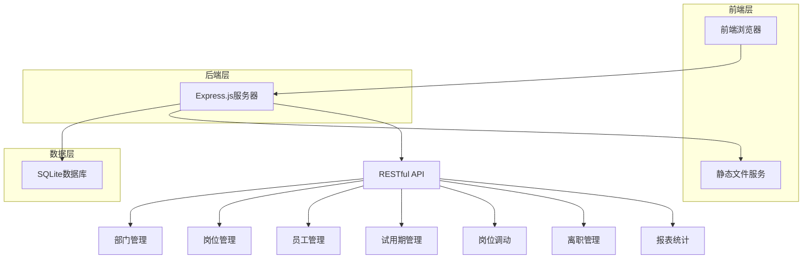

# HR管理系统 Agent说明文档

本文档旨在帮助AI Agent快速理解整个HR管理系统的整体架构与细节实现，以便能够有效地协助用户进行系统的维护、扩展和故障排除。

## 系统概述

这是一个基于Node.js和Express.js的全栈人力资源管理系统，采用SQLite作为数据存储方案。系统实现了完整的人力资源管理功能，包括部门管理、岗位管理、员工管理、试用期管理、岗位调动、离职管理和报表统计等核心模块。

## 整体架构

### 技术架构图



### 核心组件说明

1. **server.js** - 后端核心文件
   - 实现RESTful API接口
   - 管理数据库连接和操作
   - 提供静态文件服务

2. **public/index.html** - 前端主页面
   - 单页应用(SPA)结构
   - 包含所有功能模块的UI界面
   - 导航菜单和内容区域

3. **public/js/main.js** - 前端逻辑处理
   - 页面切换和路由管理
   - API调用和数据处理
   - 表单验证和交互逻辑

4. **public/css/style.css** - 样式文件
   - 基于Bootstrap的定制样式
   - 页面布局和组件样式

## 数据模型详解

### 1. departments (部门表)
```sql
CREATE TABLE departments (
  id INTEGER PRIMARY KEY AUTOINCREMENT,
  name TEXT NOT NULL,           -- 部门名称
  description TEXT,             -- 描述
  created_at DATETIME DEFAULT CURRENT_TIMESTAMP  -- 创建时间
)
```

### 2. positions (岗位表)
```sql
CREATE TABLE positions (
  id INTEGER PRIMARY KEY AUTOINCREMENT,
  name TEXT NOT NULL,           -- 岗位名称
  description TEXT,             -- 描述
  department_id INTEGER,        -- 所属部门ID
  created_at DATETIME DEFAULT CURRENT_TIMESTAMP, -- 创建时间
  FOREIGN KEY (department_id) REFERENCES departments (id)
)
```

### 3. employees (员工表)
```sql
CREATE TABLE employees (
  id INTEGER PRIMARY KEY AUTOINCREMENT,
  employee_id TEXT UNIQUE NOT NULL,  -- 员工编号
  name TEXT NOT NULL,                -- 姓名
  gender TEXT,                       -- 性别
  birth_date DATE,                   -- 出生日期
  phone TEXT,                        -- 电话
  email TEXT,                        -- 邮箱
  address TEXT,                      -- 地址
  department_id INTEGER,             -- 部门ID
  position_id INTEGER,               -- 岗位ID
  hire_date DATE,                    -- 入职日期
  status TEXT DEFAULT 'active',      -- 状态(active, probation, transferred, resigned)
  created_at DATETIME DEFAULT CURRENT_TIMESTAMP, -- 创建时间
  FOREIGN KEY (department_id) REFERENCES departments (id),
  FOREIGN KEY (position_id) REFERENCES positions (id)
)
```

### 4. probation_periods (试用期表)
```sql
CREATE TABLE probation_periods (
  id INTEGER PRIMARY KEY AUTOINCREMENT,
  employee_id INTEGER NOT NULL,      -- 员工ID
  start_date DATE NOT NULL,          -- 开始日期
  end_date DATE NOT NULL,            -- 结束日期
  status TEXT DEFAULT 'ongoing',     -- 状态(ongoing, completed, terminated)
  notes TEXT,                        -- 备注
  created_at DATETIME DEFAULT CURRENT_TIMESTAMP, -- 创建时间
  FOREIGN KEY (employee_id) REFERENCES employees (id)
)
```

### 5. position_transfers (岗位调动表)
```sql
CREATE TABLE position_transfers (
  id INTEGER PRIMARY KEY AUTOINCREMENT,
  employee_id INTEGER NOT NULL,      -- 员工ID
  from_department_id INTEGER,        -- 原部门ID
  from_position_id INTEGER,          -- 原岗位ID
  to_department_id INTEGER,          -- 调至部门ID
  to_position_id INTEGER,            -- 调至岗位ID
  transfer_date DATE NOT NULL,       -- 调动日期
  reason TEXT,                       -- 调动原因
  approved_by TEXT,                  -- 审批人
  created_at DATETIME DEFAULT CURRENT_TIMESTAMP, -- 创建时间
  FOREIGN KEY (employee_id) REFERENCES employees (id),
  FOREIGN KEY (from_department_id) REFERENCES departments (id),
  FOREIGN KEY (from_position_id) REFERENCES positions (id),
  FOREIGN KEY (to_department_id) REFERENCES departments (id),
  FOREIGN KEY (to_position_id) REFERENCES positions (id)
)
```

### 6. resignations (离职记录表)
```sql
CREATE TABLE resignations (
  id INTEGER PRIMARY KEY AUTOINCREMENT,
  employee_id INTEGER NOT NULL,      -- 员工ID
  resignation_date DATE NOT NULL,    -- 离职日期
  reason TEXT,                       -- 离职原因
  notes TEXT,                        -- 备注
  approved_by TEXT,                  -- 审批人
  created_at DATETIME DEFAULT CURRENT_TIMESTAMP, -- 创建时间
  FOREIGN KEY (employee_id) REFERENCES employees (id)
)
```

## API接口详解

### 部门管理接口

#### 获取所有部门
- **URL**: `/api/departments`
- **Method**: GET
- **Response**: 部门列表数组

#### 添加部门
- **URL**: `/api/departments`
- **Method**: POST
- **Request Body**: 
  ```json
  {
    "name": "部门名称",
    "description": "部门描述"
  }
  ```

#### 更新部门
- **URL**: `/api/departments/:id`
- **Method**: PUT
- **Request Body**: 
  ```json
  {
    "name": "部门名称",
    "description": "部门描述"
  }
  ```

#### 删除部门
- **URL**: `/api/departments/:id`
- **Method**: DELETE

### 岗位管理接口

#### 获取所有岗位
- **URL**: `/api/positions`
- **Method**: GET
- **Response**: 岗位列表数组（包含部门名称）

#### 添加岗位
- **URL**: `/api/positions`
- **Method**: POST
- **Request Body**: 
  ```json
  {
    "name": "岗位名称",
    "description": "岗位描述",
    "department_id": 1
  }
  ```

#### 更新岗位
- **URL**: `/api/positions/:id`
- **Method**: PUT
- **Request Body**: 
  ```json
  {
    "name": "岗位名称",
    "description": "岗位描述",
    "department_id": 1
  }
  ```

#### 删除岗位
- **URL**: `/api/positions/:id`
- **Method**: DELETE

### 员工管理接口

#### 获取所有员工
- **URL**: `/api/employees`
- **Method**: GET
- **Response**: 员工列表数组（包含部门和岗位名称）

#### 添加员工
- **URL**: `/api/employees`
- **Method**: POST
- **Request Body**: 
  ```json
  {
    "employee_id": "员工编号",
    "name": "员工姓名",
    "gender": "性别",
    "birth_date": "1990-01-01",
    "phone": "电话",
    "email": "邮箱",
    "address": "地址",
    "department_id": 1,
    "position_id": 1,
    "hire_date": "2023-01-01"
  }
  ```

#### 更新员工
- **URL**: `/api/employees/:id`
- **Method**: PUT
- **Request Body**: 
  ```json
  {
    "employee_id": "员工编号",
    "name": "员工姓名",
    "gender": "性别",
    "birth_date": "1990-01-01",
    "phone": "电话",
    "email": "邮箱",
    "address": "地址",
    "department_id": 1,
    "position_id": 1,
    "hire_date": "2023-01-01"
  }
  ```

#### 删除员工
- **URL**: `/api/employees/:id`
- **Method**: DELETE

### 试用期管理接口

#### 获取所有试用期记录
- **URL**: `/api/probation-periods`
- **Method**: GET
- **Response**: 试用期记录列表数组（包含员工信息）

#### 添加试用期记录
- **URL**: `/api/probation-periods`
- **Method**: POST
- **Request Body**: 
  ```json
  {
    "employee_id": 1,
    "start_date": "2023-01-01",
    "end_date": "2023-04-01",
    "notes": "备注"
  }
  ```

#### 更新试用期记录
- **URL**: `/api/probation-periods/:id`
- **Method**: PUT
- **Request Body**: 
  ```json
  {
    "employee_id": 1,
    "start_date": "2023-01-01",
    "end_date": "2023-04-01",
    "status": "completed",
    "notes": "备注"
  }
  ```

#### 删除试用期记录
- **URL**: `/api/probation-periods/:id`
- **Method**: DELETE

### 岗位调动管理接口

#### 获取所有岗位调动记录
- **URL**: `/api/position-transfers`
- **Method**: GET
- **Response**: 岗位调动记录列表数组（包含员工和部门岗位信息）

#### 添加岗位调动记录
- **URL**: `/api/position-transfers`
- **Method**: POST
- **Request Body**: 
  ```json
  {
    "employee_id": 1,
    "from_department_id": 1,
    "from_position_id": 1,
    "to_department_id": 2,
    "to_position_id": 2,
    "transfer_date": "2023-01-01",
    "reason": "调动原因",
    "approved_by": "审批人"
  }
  ```
- **说明**: 添加记录的同时会更新员工表中的部门和岗位信息

#### 删除岗位调动记录
- **URL**: `/api/position-transfers/:id`
- **Method**: DELETE

### 离职管理接口

#### 获取所有离职记录
- **URL**: `/api/resignations`
- **Method**: GET
- **Response**: 离职记录列表数组（包含员工信息）

#### 添加离职记录
- **URL**: `/api/resignations`
- **Method**: POST
- **Request Body**: 
  ```json
  {
    "employee_id": 1,
    "resignation_date": "2023-01-01",
    "reason": "离职原因",
    "notes": "备注",
    "approved_by": "审批人"
  }
  ```
- **说明**: 添加记录的同时会更新员工表中的状态为"resigned"

#### 删除离职记录
- **URL**: `/api/resignations/:id`
- **Method**: DELETE

### 报表统计接口

#### 新聘员工报表
- **URL**: `/api/reports/new-hires`
- **Method**: GET
- **Query Parameters**: 
  - start_date: 开始日期
  - end_date: 结束日期
- **Response**: 符合条件的员工列表

#### 离职员工报表
- **URL**: `/api/reports/resignations`
- **Method**: GET
- **Query Parameters**: 
  - start_date: 开始日期
  - end_date: 结束日期
- **Response**: 符合条件的离职记录列表

#### 岗位调动报表
- **URL**: `/api/reports/transfers`
- **Method**: GET
- **Query Parameters**: 
  - start_date: 开始日期
  - end_date: 结束日期
- **Response**: 符合条件的岗位调动记录列表

## 前端实现细节

### 页面结构
系统采用单页应用(SPA)设计，主要包含以下几个功能页面：
1. 控制台(Dashboard)
2. 部门管理
3. 岗位管理
4. 员工管理
5. 试用期管理
6. 岗位调动
7. 离职管理
8. 报表统计

### 页面切换机制
通过监听侧边栏导航链接的点击事件，使用`showPage()`函数切换不同页面的显示状态。

### 数据交互流程
1. 页面加载时通过AJAX请求获取数据
2. 将数据渲染到表格中
3. 用户操作（增删改）通过API接口与后端通信
4. 操作成功后重新加载数据并更新界面

### 表单处理
每个功能模块都有对应的模态框表单，通过监听按钮点击事件打开模态框，并根据是否传入ID判断是新增还是编辑操作。

## 扩展建议

### 功能扩展
1. 添加角色权限管理
2. 增加员工考勤管理模块
3. 添加薪资管理模块
4. 增加培训管理模块

### 技术改进
1. 引入前端框架（如React或Vue.js）
2. 使用专业数据库（如MySQL或PostgreSQL）
3. 添加单元测试
4. 实现JWT认证机制

### 性能优化
1. 添加数据分页功能
2. 实现数据缓存机制
3. 添加数据库索引优化查询性能
4. 压缩静态资源文件

## 常见问题排查

### 数据库相关
1. 如果遇到数据库锁定问题，检查是否有其他进程正在访问数据库文件
2. 如果数据无法保存，确认磁盘空间是否充足

### 前端相关
1. 如果页面无法加载，确认服务器是否正常运行
2. 如果数据无法显示，检查浏览器控制台是否有错误信息

### 后端相关
1. 如果API接口返回500错误，查看服务器日志定位具体问题
2. 如果端口被占用，修改server.js中的端口号配置

## 维护指南

### 代码规范
1. 后端代码遵循JavaScript标准风格
2. 前端代码使用语义化的HTML和CSS类名
3. 变量命名采用驼峰命名法

### 版本管理
1. 使用Git进行版本控制
2. 遵循语义化版本控制规范
3. 重要变更需要更新README文档

### 安全考虑
1. 生产环境中应避免使用SQLite，推荐使用专业数据库
2. 对用户输入进行验证和过滤
3. 敏感信息不应硬编码在代码中

通过以上文档，AI Agent应该能够全面理解系统的架构和实现细节，在协助用户时能够提供准确的技术支持。